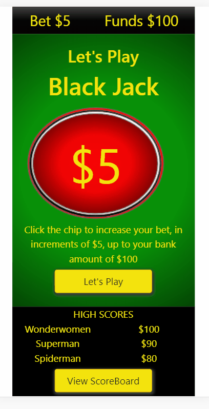
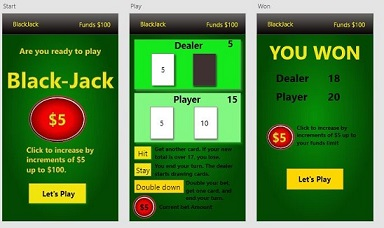

# BlackJack

### Table of Contents

1. Project Demo Link
2. Purpose
3. Motivation
4. Wireframe
5. How to play
6. Technologies Used

### Project Demo Link: [BlackJack App](https://smiley-blackjack-game.netlify.app/)

### Purpose:

A traditional BlackJack web app

### Motivation:

The goal was to practice building apps in shorter time periods, write cleaner code, and improve user experience with animation. This meant pre-planning with hi-fi wire-framing using Adobe XD, using React-Bootstrap while developing with React, practicing animations, and intentional breaking the code into smaller components.

##### Special Update 
This project was updated a year later to include backend integration with Netlify server-less functions and database support using AirTable.com. The goal was to allow a user to save their high score and see other players high score.

### WireFrame

### How to play:

- The player is allow to bet in increments of \$5 up to their funds limit
- The player tries to collect cards with the values total equal to or under 21.
- The player goal is to have a sum of card values that is less then the dealer's hand but not over 21.

### This app was built with the following technologies:

**React:** JavaScript front-end library for building user interfaces

**Netlify**: Web developer platform for hosting infrastructure, continuous integration, deployment pipeline with GitHub, and serverless backend services.

**Airtable** Web developer platform with a spreadsheet-database hybrid that allow users to access to data.

**Git-Hub:** Web-based version control repository and Internet hosting service

**Abode XD** A wire-framing tool used to create a mockup/visual of what is to be coded

**JavaScript:** Object-oriented programming language for web pages

**HTML:** Mark-up language for creating web pages

**CSS:** A formatting language for styling web pages

_Updated by JC Smiley in August of 2020_
